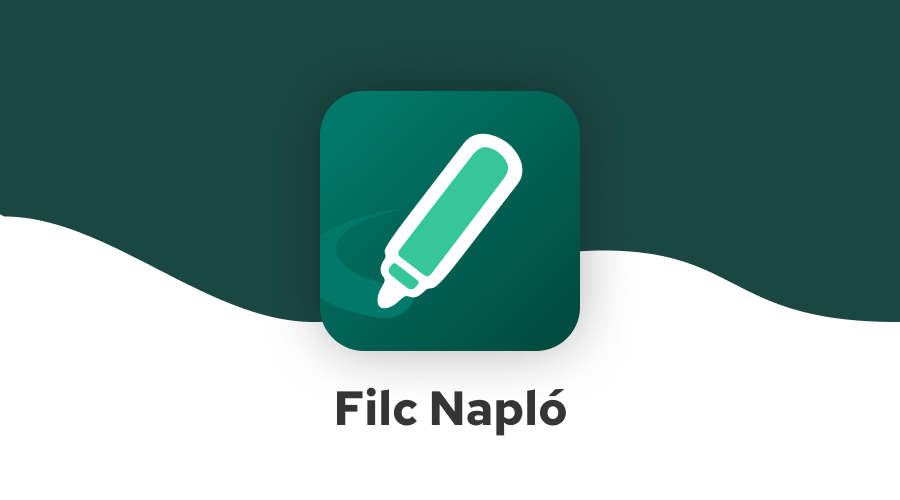

### A Filc Napló és minden más jelentős alternatív Kréta kliens **letiltásra került Google Play-en**.

A Filc Napló és minden más jelentős alternatív Kréta kliens letiltásra került Google Play-en, azonban Galaxy Store-on, App Galleryn, AppStore-on és F-Droidon továbbra is elérhetők vagyunk.\
**[További információ](https://filcnaplo.hu/dmca)**

A népszerű Filc alkalmazás, alapoktól újraírva. Az eddiginél is gyorsabb és még könnyebben kezelhető.

### [Letöltés](https://filcnaplo.hu/dmca/#telepites)

### Miért írtátok újra?

Két oka is van. Az egyik az, hogy hogy a régi Filc a Szivacs kódjára épült, amit mi csak foltozgattunk, így egyre átláthatatlanabbá vált a kódbázis. A másik ok a Kréta új alkalmazása, ami már viszonylag gyors és egész könnyen kezelhető. Mivel versenyben szeretnénk maradni, a Filcet egy teljes körű iskolai asszisztenssé szeretnénk tenni, ami segít az időd beosztásában, a tanulmányaidban és mindenben IS.

### Hol léphetek veletek kapcsolatba?

* Itt, a GitHub-on. A pontosan megfogalmazott hibajelentéseket és funkciókéréseket az [issues oldalon](https://github.com/filcnaplo/filcnaplo/issues) várjuk, ha van GitHub fiókod.
* [Discord-on](https://filcnaplo.hu/discord). Bármilyen témában (hibajelentés, funkciókérés, jaj-miért-nem-működik probléma) szívesen várunk.
* Email-ben. A filcnaplo@gmail.com email-címen is elérhetsz minket, ha sem github, sem discord fiókod nincs.

### Loptok adatot?

Nem, a Filc Napló nem gyűjt se bejelentkezési, se egyéb (például statisztikai) adatokat. Részletesebben a https://filcnaplo.hu/privacy oldalon olvashatsz erről.

### Hogyan segíthetek?
* Először is a Filc terjesztésével. Oszd meg az osztálytársaiddal, barátaiddal. Ezzel jót teszel nekik és nekünk is.
* Csatlakozhatsz a bétaprogramhoz, így a szokásosnál előbb kapod meg az új funkciókat. Az esetlegesen felmerülő hibákat GitHub-on vagy Discordon jelentheted.
* Programozással. Forkold a repót, javíts ki egy hibát, vagy valósíts meg egy új funkciót, és küldj egy pull requestet. Kérjük, mindezt ne a master, hanem a legfrissebb állapotot tükröző dev branchen tedd.
* Új ötletekkel. Ha eszedbe jut valami, amitől a Filc jobb lesz, ne habozz megosztani velünk Discordon, vagy Issue formájában.
* Adománnyal, ahogy fentebb említettük.
